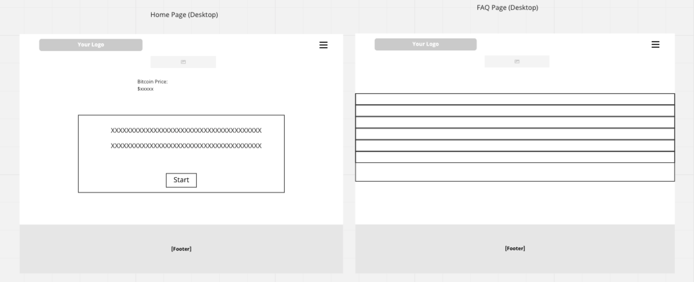
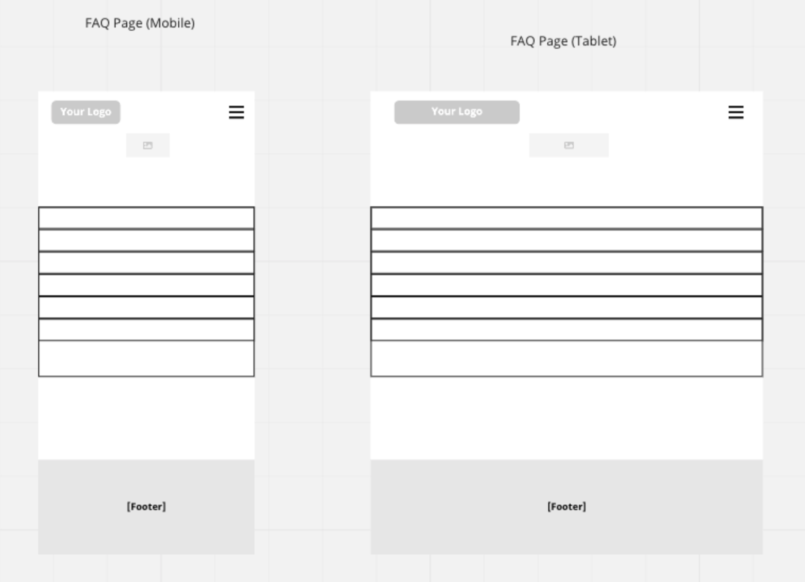

# Yoel's Portfolio 1 website

## User-Centric Frontend Development Milestone Project.

Website presents Yoel's portfolio-1 project for a Personal trainer.
Users will be able to find interesting content in easy and simple way.

This project is for educational purposes and can not be used as a template for a business use.
Main aim is to build responsive website with HTML and CSS only. I will use Bootstrap framework to keep website consent and clear.

## [View life website in github pages](https://yoesk8.github.io/portfolio-project-1/)
---

# Table of contents

- [UX](#ux)
    - [Website owner business goals](#website-owner-business-goals)
    - [User goals](#user-goals)
        - [New user goals](#new-user-goals)
        - [Returning user goals](#returning-user-goals)
        - [Website owner business goals](#website-owner-business-goals)
    - [User stories](#user-stories)
    - [Structure of the website](#structure-of-the-website)
    - [Wireframes](#wireframes)
    - [Surface](#surface)
- [Features](#features)
- [Technology](#technology)
- [Testing](#testing)
    - [Functionality testing](#functionality-testing)
    - [Compatibility testing](#compatibility-testing)
    - [Code Validation](#code-validation)
    - [User stories testing](#user-stories-testing)
    - [Issues found during site development](#issues-found-during-site-development)
    - [Performance testing](#performance-testing)
- [Deployment](#deployment)
- [Credits](#credits)
- [Screenshots](#screenshots)

# UX

## Website owner business goals

The main purpose of this website is to help present a Personal trainer and strength and conditioning coach to the public.
Page owner can present himself, his professional development path, achievements and top skills.
Also this website is the best place to show types of personal training, his qualifications and personal qualities that make him a suitable choice for his potential clients.

## User goals

### New user goals:
- user is able to find information about the Personal trainer.
- user can easily locate former and current client testimonials.

### Returning user goals:
- user can learn more about the trainer.
- user is able to find gallery with pictures of classes and the gym studio used for the sessions.
- user can send a message to the instructor using a contact form.

## User stories

### As a business owner:
* I would like to present myself and my offer on the website clearly to potential customers.
* I need to make sure that my current and new customers will find a professional help with their personal or group training programs.
* I want my customers to be able to learn how to use my website intuitively and easily.
* I would like to build and maintain relationship with potential and current customers.

### As a new customer:
* I wish to find information about the personal trainer and check his qualifications.
* I would like to be able to contact the trainer with any questions I may have about his services. 
* I want to join in a fitness group with professional trainer, to find motivation and spend time actively.

### As a returning customer:

* I need to contact my trainer to reschedule my session.
* I want to show my friend a gallery of pictures of the fitness studio where we can join for a group personal training session.

## Structure of the website

The website is designed to be easy and user-friendy on all type of devices. On desktop, tablet or mobile device there should be no difference for a user to have a fantastic experience. All parts are designed to achieve maximum user satisfaction. User will get some interaction from the interface as links and buttons will have a hover effects.

## Wireframes

I used website miro.com to create the wireframes for desktop, tablet and mobile view.

## Desktop View

## Tablet and Mobile View

.png) 

## Surface

### Colors
For the color Palette I used the colors for the traditional Bitcoin logo:
* background color: #f2a900
* navigation bar and footer color: #4d4d4e
* Socials color: #ffffff

### Fonts 

* As a main font I used Helvetica Neue, and as a backup font sans-serif

[Back to Table of contents](#table-of-contents)
___
# Features

The website consists of 3 pages. One of which is divided into 3 sections. Every page and section is accessible from the navigation menu.

The website has below features:

## Navigation bar

* #### Navigation bar is visible on the top of each website. It is responsive and will adapt to mobile devices by a change into a burger menu.
* Navigation scheme:

    * On left side there is a logo. It can be used as navigation link to the main page.
    * On right side there are three links or a burger menu.  It contains:
        * Home
        * Contact
        * Gallery

## Footer

* Footer is consistent on all pages. It has social links centered on it.
Each link will open in a separate tab in a browser. I've also added hover effects to each of them based on the color of the social media site.

## Home

* ### About section

    * About section includes a description of the personal trainer's personna, qualities, qualifications and approach to personal training

* ### Testimonials section

    * This section includes 3 separate testimonials from former and current clients of the personal trainer in question.

## Gallery

* This page has pictures of 1 on 1 training session plus pictures of the studio used for the training and its facilities 

## Contact

* Contact form is a main part on this site. User can contact by filling a form with topic of interest.
There's also an aditional text field to include any additional questions.

##  Future implementations

* Add new page with personal training packages descriptions.
* A blog site with fitness advises.
* Login site for paid content including videos, exercise's how to, meal planning and healthy meals recipes.

[Back to Table of contents](#table-of-contents)
___
# Technologies used

### HTML5
* As a structure language.

### CSS
* As a style language.

### Bootstrap 
* Bootstrap as a CSS framework to keep responsive, mobile first aproach.

### Font Awesome
* As an icon library for a social links.

### GitHub
* As a software hosting platform to keep project in a remote location.

### Git
* As a version-control system tracking.

### Gitpod
* As a development hosting platform.

### Balsamiq.cloud
* As a wireframing tool.

[Back to Table of contents](#table-of-contents)

___
# Testing

## Functionality testing 

 I used Chrome developer tools throughout the project for testing and solving problems with responsiveness and style issues.

## Compatibility testing
 Site was tested across multiple virtual mobile devices and browsers. I checked all supported devices in Chrome developer tools. 
 
 I tested on hardware devices such as: Ipad air with iOS, Iphone 13 mini with iOS 15.4, Macbook air with MacOS

## User stories testing

### As a business owner:

- I would like to present myself and my offer on the website clearly to potential customers.
    > Name, photo of the instructor and qualifications are on the Home Page in the About section

- I need to make sure that my current and new customers will be able to contact me with any questions on training, exercises or business enquiries
    > Customers can achieve this by contacting through contact form. They can choose their topic of interest or goal and describe their needs in a message box.

- I want my customers to be able to learn how to use my website intuitively and easily.
    > Each site has a fixed navigation menu and is accessible at all times. All content is presented with minimalistic approach.

- I would like to build and maintain relationship with potential and current customers.
    > Customers are able to find a links to social channels at the bottom of each page. Alternatively they can contact via the contact form.

### As a new customer:
- I wish to find information about the personal trainer and check his qualifications.
    > User can see essential description on the home page, specifically in about section.

- I would like to get in touch with the trainer to ask him about his approach on programing training cycles.
    > User can find a contact form in contact page. 

### As a returning customer:
- I need to contact my trainer to reschedule my session.
    > User can find an option 'Reschedule my session' in the contact form in contact page. Alternatively can use social channels found at the bottom of the page.

- I want to show my friend pictures of the fitness studio where we can join for a 2 on 1  personal training session.
    > Gallery page has pictures of both the studio and sessions with other clients in development.

---
## Issues found during site development

* #### Footer not staying at the bottom of the screen in mobile devices

When displaying the website on mobile devices, my footer would move to the middle of the screen instead of staying at the bottom, blocking important elements and damaging the overall user experience.

> I fixed it by wrapping the whole page in a div that would act as a container, then setting it's minimum height to 100% of the viewport (vh) and giving it a position of relative. As it is relative it's child elements (In this case the footer) could be set with absolute position based on it.

> Then I set the footer position to absolute, sticking to the bottom:0 

* #### Form in Contact Page being out of place in mobile devices

When displayed on mobile devices the form in the contact page would look out of placed and misaligned

> I fixed this by adding a media querie that would add an additional padding of 300px when the height of the screen dropped to below 1200px (Tablets and mobile devices).

> I also had to set the top margin to 0 as it was pushing the whole div downwards

> This pushes the form to a more centred position therefore improving user experience, below the solution:

@media screen and (max-width:1200px) {

.contact {
  padding-top: 300px;
  margin-top: 0;
    
  }

## Performance testing

I run [Lighthouse](https://developers.google.com/web/tools/lighthouse/) tool to check performance of the website.
I had to do several changes to improve performance, specially replacing images for lighter formats such as .webp which improved the performance significantly. Screenshots are presented below:

Final results:

I noticed that this tests scores vary from time to time and depends on external libraries as well. 

## Code Validation
 At the and of the project I used two websites to validate my code
 
 * [W3C CSS Validator](https://jigsaw.w3.org/css-validator/) to validate CSS

 * [Nu Html Checker](https://validator.w3.org/) to test HTML

[Back to Table of contents](#table-of-contents)

___
# Deployment

The project was deployed on GitHub Pages. I used Gitpod as a development environment where I commited all changes to git version control system.
I used push command in Gitpod to save changes into GitHub.

To deploy a project I had to:

* Log in to GitHub and click on repository to deploy ([portfolio-project-1](https://yoesk8.github.io/portfolio-project-1/))
* select `Settings` and find GitHub Pages section at the very bottom of the page
* from source select `root` and then `main` branch.
* click `save` and page was deployed after auto-refresh.
>  Your site is published at https://yoesk8.github.io/portfolio-project-1/

To run localy:
* Log in to GitHub and click on repository to download ([portfolio-project-1](https://yoesk8.github.io/portfolio-project-1/))
* select `Code` and click Download the ZIP file.
* after download you can extract the file and use it in your local environment 

Alternatively you can [Clone](https://docs.github.com/en/free-pro-team@latest/github/creating-cloning-and-archiving-repositories/cloning-a-repository)
or [Fork](https://docs.github.com/en/free-pro-team@latest/github/getting-started-with-github/fork-a-repo)
this repository ([portfolio-project-1](https://yoesk8.github.io/portfolio-project-1/)) into your github account.

[Back to Table of contents](#table-of-contents)
___
# Credits

* To complete this project I used Code Institute student template: [gitpod full template](https://github.com/Code-Institute-Org/gitpod-full-template)

* Ideas and knowledge library:

    * [w3schools.com](https://www.w3schools.com)

    * [css-tricks.com](https://css-tricks.com/)

    * [getbootstrap.com/docs](https://getbootstrap.com/docs/4.5/getting-started/introduction/)
        I used code for navbar and the form in contact page from Bootstrap.
    * [stackoverflow.com](https://stackoverflow.com/) I used stack overflow constantly whenever I was unsure about HTML or CSS syntax or wanted to find an easier more stream-lined way of doing things
   

* Other Tools:
  
   * [ezgif.com](https://ezgif.com/jpg-to-webp/) I used ezgif to convert my images to lighter formats which improved the performance of the site significantly

### Code

* Bootstrap: [Navbar](https://getbootstrap.com/docs/4.0/components/navbar/)
* MDBootstrap: [Sticky footer](https://mdbootstrap.com/snippets/standard/mdbootstrap/2886162#html-tab-view)
* Bootstrap: [Form](https://getbootstrap.com/docs/4.5/components/forms/)
* [mdbootstrap.com](https://mdbootstrap.com/snippets/standard/mdbootstrap/2886162#html-tab-view) I used and modified this footer with social media icons
* [https://bbbootstrap.com/](https://bbbootstrap.com/snippets/simple-contact-form-74408136) I used and modified this form

### General Content:

*  Testimonials:  [trustpilot.com](https://uk.trustpilot.com/review/westlondonpersonaltraining.co.uk)

### Images:

#### Pexels.com:
* [images/pexels-thisisengineering-3912953.jpg](https://www.pexels.com/photo/man-in-black-crew-neck-t-shirt-standing-in-front-of-boxing-gloves-3912953/) Photo by ThisIsEngineering from Pexels 

* [images/pexels-thisisengineering-3912956.jpg](https://www.pexels.com/photo/person-holding-black-tablet-3912956/) Photo by ThisIsEngineering from Pexels

* [images/pexels-thisisengineering-3912952.jpg](https://www.pexels.com/photo/person-holding-black-smartphone-3912952/) Photo by ThisIsEngineering from Pexels 

* [images/pexels-pixabay-416717.jpg](https://www.pexels.com/photo/athlete-barbell-bodybuilder-bodybuilding-416717/) Photo by Pixabay from Pexels

* [images/pexels-bruno-bueno-2204196.jpg](https://www.pexels.com/photo/man-lying-while-doing-barbell-2204196/) Photo by Bruno Bueno from Pexels

* [images/pexels-ivan-samkov-4162451.jpg](https://www.pexels.com/photo/black-and-red-dumbbells-4162451/) Photo by Ivan Samkov from Pexels

* [images/pexels-amar-preciado-9958667.jpg"](https://www.pexels.com/photo/people-in-gym-working-out-with-weightlifting-9958667/) Photo by Amar Preciado from Pexels

* [images/pexels-andres-ayrton-6551097.jpg](https://www.pexels.com/photo/young-asian-male-trainer-checking-fitness-equipment-while-instructing-overweight-female-6551097/) Photo by Andres  Ayrton from Pexels

* [images/pexels-koolshooters-9944640.jpg](https://www.pexels.com/photo/two-people-doing-boxing-9944640/) Photo by KoolShooters from Pexels

* [images/pexels-thisisengineering-3912516.jpg](https://www.pexels.com/photo/man-in-black-crew-neck-t-shirt-standing-inside-boxing-ring-3912516/) Photo by ThisIsEngineering from Pexels 

* [images/pexels-thisisengineering-3912952.jpg](https://www.pexels.com/photo/person-holding-black-smartphone-3912952/) Photo by ThisIsEngineering from Pexels 

[Back to Table of contents](#table-of-contents)
___

# Screenshots

## Project screenshots

### Home Page

### Contact Page

### Gallery Page

[Back to Table of contents](#table-of-contents)
___