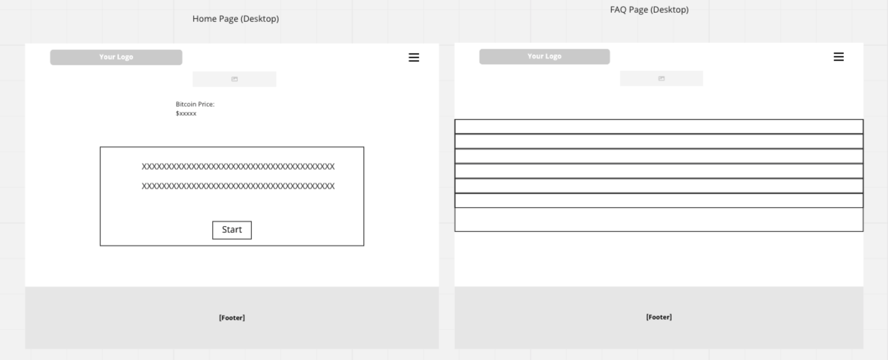

# Bitcoin Quiz

This web based application is designed to

![Responsive design]

[Deployed Site]

# Contents

* [**User Experience**](<#user-experience>)
  * [Wireframes](<#wireframes>)
  * [Site Structure](<#site-structure>)
  * [Design Choices](<#design-choices>)
    * [Fonts](<#fonts>)
    * [Colour](<#colour>)

* [**Existing Features**](<#existing-features>)

* [**Desired Features**](<#desired-features>)

* [**Technologies Used**](<#technologies-used>)

* [**Testing**](<#testing>)
  * [Code Validation](<#code-validation>)
  * [Responsive Design Check](<#responsive-design-check>)
  * [Browser Compatibility](<#browser-compatibility>)
  * [Known Bugs](<#known-bugs>)
    * [Resolved](<#resolved>)
    * [Unresolved](<#unresolved>)
  * [Lighthouse](<#lighthouse>)

* [**Deployment**](<#deployment>)
  * [To deploy the project](<#to-deploy-the-project>)
  * [To fork the repository](<#to-fork-the-repository>)
  * [To create a local clone](<#to-create-a-local-clone>)

* [**Credits**](<#credits>)
  * [Content](<#content>)
  * [Media](<#media>)

# User Experience

## Wireframes

Wireframes for Bitcoin Quiz

![Wireframe Mobile Site]

[Back to top](<#contents>)

## Site Structure

[Back to top](<#contents>)

## Design Choices

* ### Fonts

For my Fonts I used Bootstrap pre-defined font-family "Helvetica Neue", Helvetica, Arial, sans-serif.

[Back to top](<#contents>)

* ### Colour

For the Colour scheme I used Bitcoin's logo color palette:

Bitcoin Orange:
Hex: #f2a900
RGB: 242, 169, 0
Bitcoin Grey:
Hex: #4d4d4e
RGB: 77, 77, 78
Bitcoin White:
Hex: #ffffff
RGB: 255, 255, 255

[Back to top](<#contents>)

# Existing Features

## Home Page 

## Quiz Pages

## Results Page

Once the user has answered 

## Progress Bar

[Back to top](<#contents>)

# Desired Features

- More questions to make each generated quiz more unique from each other

[Back to top](<#contents>)

# Technologies Used

* [HTML5](https://html.com/html5/) - Provides content structure to the site.
* [CSS](https://www.w3.org/Style/CSS/Overview.en.html) - Adds style and responsive design to the site.
* [JavaScript](https://www.javascript.com) - Adds interactivity to the website.
* [Github](https://github.com) - Acts as a repository for the site's code.
* [Gitpod](https://www.gitpod.io) - Builds and edits the code for the site.

[Back to top](<#contents>)

# Testing

## Code Validation

[Back to top](<#contents>)

* Home Page:

![W3C Validator test result]

* Quiz Pages:

![W3C Validator test result]

The CSS validator results are below:

![CSS Validator test result]

A section of the JSHint results are below:

![JS Validator test result]

[Back to top](<#contents>)

## Responsive Design Check

* The responsive design test was carried out 

[Back to top](<#contents>)

## Browser Compatibility

Bitcoin Quiz was tested on the following browsers with no issues to the user. Opera, Google Chrome, Mozilla Firefox, and Microsoft Edge. Apprearance, responsiveness, and functionality were consistent accross the browsers and different screen sizes.

[Back to top](<#contents>)

## Known Bugs

* ### Resolved

  * 

[Back to top](<#contents>)

## Lighthouse

Bitcoin Quiz was tested using the [Lighthouse](https://developers.google.com/web/tools/lighthouse) dev tool program to test the pages for:
* Performance - How the pages run whilst loading.
* Accessibility - Checking how the site is accessible for users.
* Best Practices - Making sure the site fits with industry best practices.
* Seo - Search engine optimisation. Does the site run well with search engine results?

As an example, the results for the Home Page are as follows:

![Lighthouse home results]

[Back to top](<#contents>)

## Deployment

### **To deploy the project**
This site was deployed using the Github Pages platform. To deploy a site with Pages one must:
 1. In Github's repository, navigate to the **Settings** tab.
 2. Once in the Settings, move to the **Pages** tab in the left-hand navigation column.
 3. Under the **Branch** selector, select the **main** option and the **root** folder, then click **save**.
 4. The site will automatically deploy and a green complete banner will indicate success.

### **To fork the repository**
 A copy of the page can be done through forking the Github account. This copy can be viewed and changed without modifying the original. To fork the repository one must:
  1. Log in to **GitHub** and locate the [repository]
  2. Select the **fork** option in the top right hand corner of the page to create a copy of the repository.

### **To create a local clone**

  1. Select the **code** tab from the repository's navigation bar.
  2. Choose the **clone** option in the secondary navigation bar and copy the url provided.
  3. In your IDE of your choice open **Git Bash**
  4. Change the current working directory to the location where you want the cloned directory to be made.
  5. Type **git clone**, and then paste the URL copied from GitHub.
  6. Confirm the choice and the local clone will be created.

  [Back to top](<#contents>)

# Credits

### Content

- The icons were used through [Font Awesome](https://fontawesome.com).
- The fonts were used through [Google Fonts](fonts.google.com/specimen/Radio+Canada).
- The toggle switch was designed using the [W3schools Tutorial](https://www.w3schools.com/howto/howto_css_switch.asp).
- The progress bar was initial designed from the [W3schools Tutorial](https://www.w3schools.com/w3css/w3css_progressbar.asp).
- The initial javascript quiz code was sourced from Brian Design on [YouTube](https://www.youtube.com/watch?v=f4fB9Xg2JEY).

[Back to top](<#contents>)

### Media

- The colour scheme was used from Color My Soul on [Pinterest](https://www.pinterest.co.uk/pin/308848486943717128/).
- The background music used came courtesy of [Shane Ivers](https://www.silvermansound.com/free-music/tape-star) on Silverman Sound Studios.

[Back to top](<#contents>)

Yoel Gutierrez 2022.

[Back to top](<#contents>)