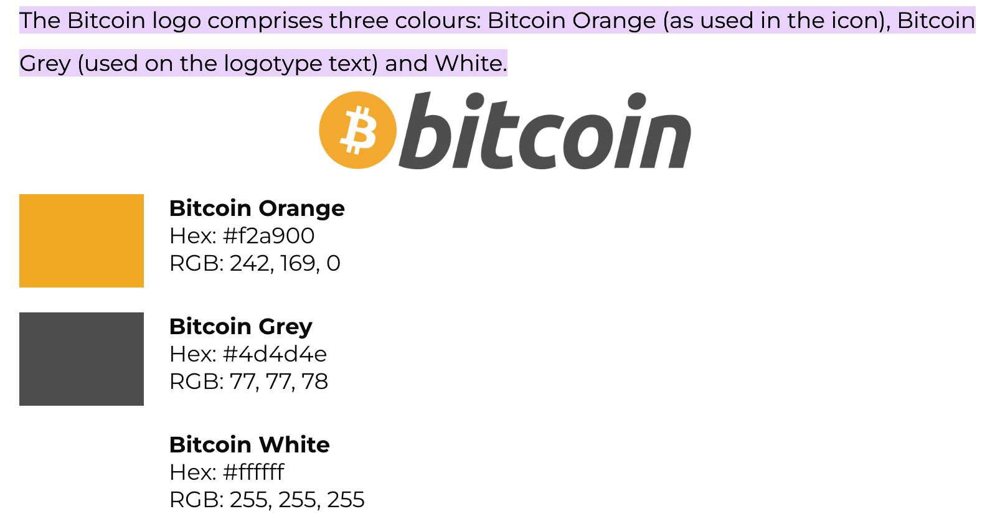

# Yoel's Portfolio 2 website

## Dynamic Front End Development Milestone Project.

Website presents Yoel's portfolio-2 project for a Bitcoin Quiz.

Users will be able to play a Quiz game to find out how much they know about bitcoin and learn even more about it with the FAQ page.

This project is for educational purposes and can not be used as a template for a business use.
Main aim is to build a responsive and interactive website with HTML, CSS and JavaScript. I will use Bootstrap framework to keep website consent and clear.

## [View life website in github pages](https://yoesk8.github.io/portfolio-2-bitcoin-quiz/)
---

# Table of contents

- [UX](#ux)
    - [Website owner business goals](#website-owner-business-goals)
    - [User goals](#user-goals)
        - [New user goals](#new-user-goals)
        - [Returning user goals](#returning-user-goals)
        - [Website owner business goals](#website-owner-business-goals)
    - [User stories](#user-stories)
    - [Structure of the website](#structure-of-the-website)
    - [Wireframes](#wireframes)
    - [Surface](#surface)
- [Features](#features)
- [Technology](#technology)
- [Testing](#testing)
    - [Functionality testing](#functionality-testing)
    - [Compatibility testing](#compatibility-testing)
    - [Code Validation](#code-validation)
    - [User stories testing](#user-stories-testing)
    - [Issues found during site development](#issues-found-during-site-development)
    - [Performance testing](#performance-testing)
- [Deployment](#deployment)
- [Credits](#credits)
- [Screenshots](#screenshots)

# UX

## Website owner business goals

The main purpose of this website is to test the user's knowledge on what Bitcoin is by playing an interactive game with 10 questions. The user can also find the answer to this questions and learn more about it in the FAQ page.

## User goals

### New user goals:
- User is able to play the game with no issues
- User can see the live price of Bitcoin on the Home page.
- User can easily navigate between the Home, Contact and FAQ pages.

### Returning user goals:
- User can learn more about the developer by using the social medial links in the footer of the site.
- User can get in touch with the Developer by using the contact page.

## User stories

### As a creator of the site:
* I would like to display my abbilities as a web developer.
* I would like to educate all visitors on the Basics of what Bitcoin is and isn't.

## Structure of the website

The website is designed to be easy and user-friendy on all type of devices. On desktop, tablet or mobile device there should be no difference for a user to have a fantastic experience. All parts are designed to achieve maximum user satisfaction. User will get some interaction from the interface as links and buttons will have a hover effects.

## Wireframes

I used website miro.com to create the wireframes for desktop, tablet and mobile view.

## Desktop View

## Tablet and Mobile View

.png) 

## Surface

### Colors
For the color Palette I used the colors for the traditional Bitcoin logo:
* background color: #f2a900
* navigation bar and footer color: #4d4d4e
* Socials color: #ffffff

### Fonts 

* As a main font I used Helvetica Neue, and as a backup font sans-serif

[Back to Table of contents](#table-of-contents)
___
# Features

The website consists of 3 pages. One of which includes the Quiz game to be played. Every page and section is accessible from the navigation menu.

The website has below features:

## Navigation bar

* #### Navigation bar is visible on the top of each website. It is responsive and by default collapsed into a burger menu.
* Navigation scheme:

    * On left side there is a logo. It can be used as navigation link to the main page.
    * On right side there are three links collapsed into a burger menu.  It contains:
        * Home
        * FAQ
        * Contact

## Footer

* Footer is consistent on all pages. It has social links centered on it.
Each link will open in a separate tab in a browser. I've also added hover effects to each of them based on the color of the social media site.

## Home

*  The home Page comprises of:
 * A live price of Bitcoin displayed underneath the navbar, this is achieved by using the [Binance API](https://www.binance.com/en/binance-api) with the help of a Websocket.
 * A quiz game contained inside a Div for easy readability, the game consists of 10 questions, the color of the buttons containing the questions change to either green or red depending on whether the answer was correct or not.

## FAQ

* This page has 6 common questions about bitcoin, it was created with the help of [Bootstrap's Accordion](https://getbootstrap.com/docs/5.0/components/accordion/) 

## Contact

* User can get in touch with the creator of the website by filling a form with topic of interest.
There's also an aditional text field to include any additional questions.

##  Future implementations

* Add new page with useful Bitcoin resources )(Books, podcasts, blogs, etc)
* Add page that displays the price of bitcoin denominated in commodities (Gold, Silver, Oil, Copper, etc)

[Back to Table of contents](#table-of-contents)
___
# Technologies used

### HTML5
* As a structure language.

### CSS
* As a style language.

### JavaScript
* As a programming language

### Bootstrap 
* Bootstrap as a CSS framework to keep responsive, mobile first aproach.

### Font Awesome
* As an icon library for a social links.

### GitHub
* As a software hosting platform to keep project in a remote location.

### Git
* As a version-control system tracking.

### Gitpod
* As a development hosting platform.

### Miro.com
* As a wireframing tool.

[Back to Table of contents](#table-of-contents)

___
# Testing

## Functionality testing 

 I used Chrome developer tools throughout the project for testing and solving problems with responsiveness and style issues.

## Compatibility testing
 Site was tested across multiple virtual mobile devices and browsers. I checked all supported devices in Chrome developer tools. 
 
 I tested on hardware devices such as: Ipad air with iOS, Iphone 13 mini with iOS 15.4, Macbook air with MacOS and Surface Pro with windows 10

## User stories testing

### As a website owner:

-  I would like to display my abbilities as a web developer.
   > User can interact with the site by playing a game that keeps track of the answers chosen during the game and see their final result once finished
- I would like to educate all visitors on the Basics of what Bitcoin is and isn't.
   > User can use the FAQ page to read the answers to 6 of the most asked questions about Bitcoin, the user can also get in touch with the developer to ask further questions

### As a new user:
- I want to play a game to learn about Bitcoin
   > User can play a game containing 10 interesting facts about Bitcoin
- I want to know what the price of Bitcoin is at the moment
   > User can see the live price of Bitcoin displayed in the Home screen
- I would like to get in touch with the creator of the site to ask him about his web developing skills or to learn more about bitcoin.
    > User can find a contact form in contact page. 

### As a returning user:
- I need to find more information about the skills and projects that the developer may have worked on.
    > User can use the LinkedIn or GitHub social links on the footer of the site or use the contact form to get in touch directly with the developer

---
## Issues found during site development

* #### Footer not staying at the bottom of the screen in mobile devices

When displaying the website on mobile devices, my footer would move to the middle of the screen instead of staying at the bottom, blocking important elements and damaging the overall user experience.

> I fixed it by wrapping the whole page in a div that would act as a container, then setting it's minimum height to 100% of the viewport (vh) and giving it a position of relative. As it is relative it's child elements (In this case the footer) could be set with absolute position based on it.

> Then I set the footer position to absolute, sticking to the bottom:0 

* #### Form in Contact Page being out of place in mobile devices

When displayed on mobile devices the form in the contact page would look out of placed and misaligned

> I fixed this by adding a media querie that would add an additional padding of 300px when the height of the screen dropped to below 1200px (Tablets and mobile devices).

> I also had to set the top margin to 0 as it was pushing the whole div downwards

> This pushes the form to a more centred position therefore improving user experience, below the solution:

@media screen and (max-width:1200px) {

.contact {
  padding-top: 300px;
  margin-top: 0;
    
  }

## Performance testing

I run [Lighthouse](https://developers.google.com/web/tools/lighthouse/) tool to check performance of the website.
Screenshots are presented below:

Final results:

I noticed that this tests scores vary from time to time and depends on external libraries as well. 

## Code Validation
 At the and of the project I used two websites to validate my code
 
 * [W3C CSS Validator](https://jigsaw.w3.org/css-validator/) to validate CSS

 * [Nu Html Checker](https://validator.w3.org/) to test HTML

 * [JShint](https://jshint.com/) to test JavaScript

[Back to Table of contents](#table-of-contents)

___
# Deployment

The project was deployed on GitHub Pages. I used Gitpod as a development environment where I commited all changes to git version control system.
I used push command in Gitpod to save changes into GitHub.

To deploy a project I had to:

* Log in to GitHub and click on repository to deploy [portfolio-project-2-Bitcoin-Quiz](https://yoesk8.github.io/portfolio-2-bitcoin-quiz/)
* select `Settings` and find GitHub Pages section at the very bottom of the page
* from source select `root` and then `main` branch.
* click `save` and page was deployed after auto-refresh.
>  Your site is published at https://yoesk8.github.io/portfolio-2-bitcoin-quiz/

To run localy:
* Log in to GitHub and click on repository to download [portfolio-project-2-Bitcoin-Quiz](https://github.com/yoesk8/portfolio-2-bitcoin-quiz)
* select `Code` and click Download the ZIP file.
* after download you can extract the file and use it in your local environment 

Alternatively you can [Clone](https://docs.github.com/en/free-pro-team@latest/github/creating-cloning-and-archiving-repositories/cloning-a-repository)
or [Fork](https://docs.github.com/en/free-pro-team@latest/github/getting-started-with-github/fork-a-repo)
this repository [portfolio-project-2-Bitcoin-Quiz](https://github.com/yoesk8/portfolio-2-bitcoin-quiz) into your github account.

[Back to Table of contents](#table-of-contents)
___
# Credits

* To complete this project I used Code Institute student template: [gitpod full template](https://github.com/Code-Institute-Org/gitpod-full-template)

* Ideas and knowledge library:

    * [w3schools.com](https://www.w3schools.com)

    * [css-tricks.com](https://css-tricks.com/)

    * [youtube.com/webdevsimplified](https://youtu.be/riDzcEQbX6k) I followed this tutorial to create the quiz that was later modified

    * [youtube.com/MorganPage](https://youtu.be/XXuUNZIQUVA) I followed this tutorial to create the websocket that would display the live price of Bitcoin in the Home Page.

    * [getbootstrap.com/docs](https://getbootstrap.com/docs/4.5/getting-started/introduction/)
        I used code for [navbar](https://getbootstrap.com/docs/5.2/components/navbar/), [accordion](https://getbootstrap.com/docs/5.2/components/accordion/)from Bootstrap.

    * [MDBootstrap](https://mdbootstrap.com/docs/b4/jquery/forms/contact/) I used this contact form for the contact page.

    * [stackoverflow.com](https://stackoverflow.com/) I used stack overflow constantly whenever I was unsure about HTML, CSS or JavaScript   syntax or wanted to find an easier more stream-lined way of doing things.
   

### Code

* MDBootstrap: [Contact Form](https://mdbootstrap.com/docs/b4/jquery/forms/contact/)
* Bootstrap: [Offcanvas Navbar](https://getbootstrap.com/docs/4.5/components/navbar/)

### General Content:

*  Quotes used in Main Div:  [coinsource.com](https://blog.coinsource.net/20-famous-and-infamous-quotes-about-bitcoin/#:~:text=%E2%80%9CBitcoin%20is%20a%20technological%20tour%20de%20force.%E2%80%9D&text=%E2%80%9CI%20do%20think%20bitcoin%20is,something%20like%20change%20the%20world.%E2%80%9D&text=%E2%80%9CBitcoin%20is%20going%20to%20change,Africa%2C%20but%20for%20everywhere.%E2%80%9D)

* FAQ questions [bitcoin.org](https://bitcoin.org/en/faq#what-are-the-advantages-of-bitcoin)

* Game questions and answers [welovequizzes.com](https://www.welovequizzes.com/bitcoin-quiz-questions-and-answers/)

[Back to Table of contents](#table-of-contents)
___

# Screenshots

## Project screenshots

### Home Page

### Contact Page

### FAQ Page

[Back to Table of contents](#table-of-contents)
___